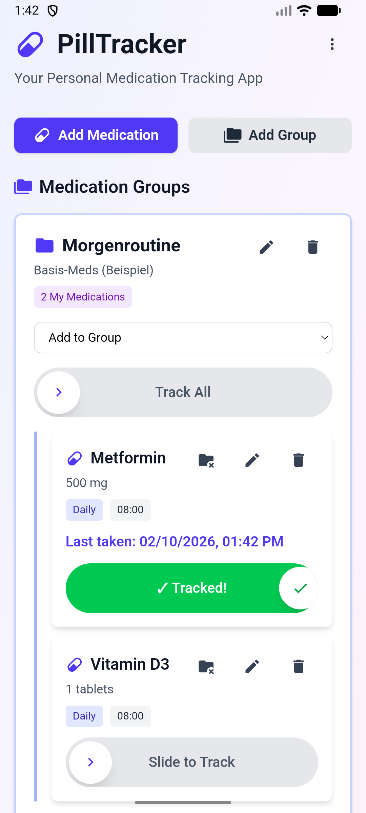
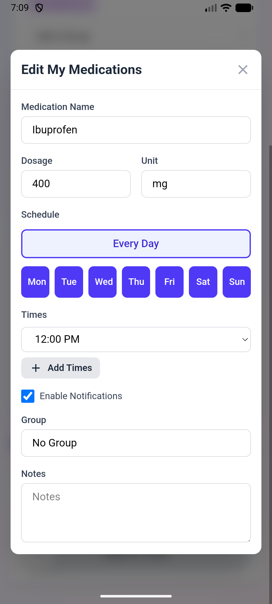

# PillTracker

Offline-first Medikamenten-Tracking-App (React + Capacitor + native SQLite).

Status: **Alpha / Testing** (Schema und Features koennen sich noch stark aendern; Daten koennen bei Updates zurueckgesetzt werden).

## Stack

- React + Vite + TypeScript
- Capacitor (Android/iOS WebView Shell)
- Native SQLite via `@capacitor-community/sqlite`
- Local Notifications via `@capacitor/local-notifications`
- Android Print Preview (native Print Framework) fuer druckfreundliche Medikamentenkarten

## Worum geht's / Features

- Medikamente anlegen/bearbeiten/loeschen (inkl. Dosierung, Notizen)
- Einnahme tracken: per Slide markieren, inkl. **"zuletzt eingenommen"** Zeitstempel
- Gruppen: Medikamente gruppieren und **"Track all"** fuer eine ganze Gruppe
- Erinnerungen: Wochentage + Uhrzeiten pro Medikament, als lokale Benachrichtigungen
- Export/Drucken: druckfreundliche Medikamentenkarten (ohne Server, ueber Android Druckvorschau)

## APK (schnell testen)

Eine aktuelle Test-APK liegt unter:
`Latest Android Release/pilltracker_v1.apk`

## Screenshots

Startseite:


Medikament bearbeiten:


## Entwicklung (Web)

```bash
npm install
npm run dev
```

Hinweis: Die SQLite DB ist nur auf nativen Plattformen verfuegbar (Android/iOS).

## Android (Build/Deploy)

```bash
./run-android.sh
```

## Android E2E (Android Studio / Console) + Logs

Ziel: App bedienen ohne manuelles rumklicken und dabei SQL/Crash-Fehler sofort sehen.

1. Emulator starten (am einfachsten ueber Android Studio: Device Manager).
2. App deployen: `./run-android.sh`
3. E2E laufen lassen: `./run-e2e-tests.sh`
4. Live-Logs: `./watch-logs.sh`
5. Report (HTML): `android/app/build/reports/androidTests/connected/debug/index.html`

Die Instrumentation-Tests sind hier:
`android/app/src/androidTest/java/com/pilltracker/app/PillTrackerE2ETest.kt`

## Release Build (APK erzeugen)

```bash
./build-android-release.sh
```

Ergebnis:
`Latest Android Release/pilltracker_v1.apk`
